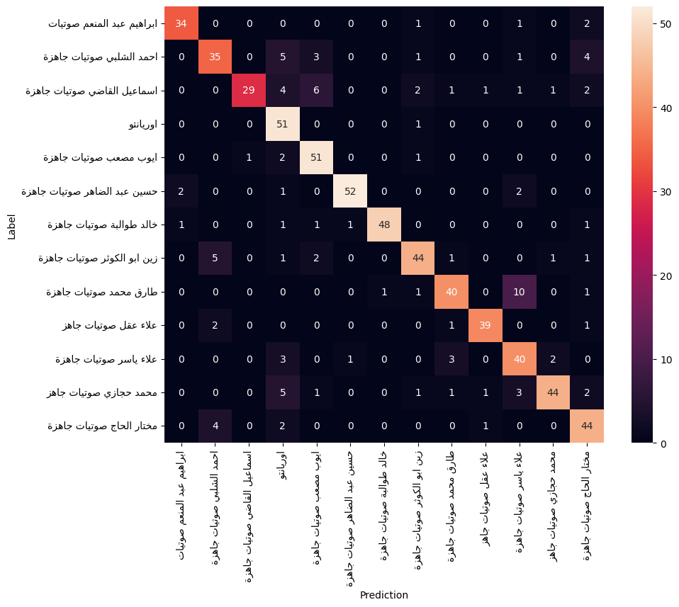
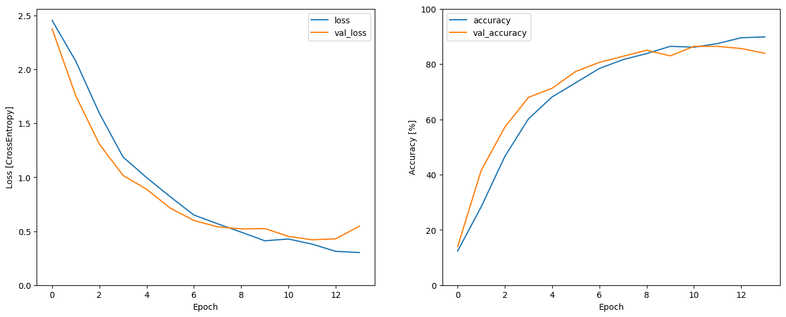

# Quran Reciter Classification Project

## Overview

This project focuses on developing a simple classification model that identifies Quran reciters from audio files. The model takes an audio file as input and outputs the predicted reciter. Spectrograms of STFT features are employed to achieve accurate classification.

## Reciters

The model currently supports the following reciters:
- احمد الشلبي
- اسماعيل القاضي
- علاء عقل
- علاء ياسر
- عبد الباسط (New)
- المنشاوي (New)
- طارق محمد (New)

More reciters will be added in the future.

## Confusion Matrix

## Accuracy & Loss

